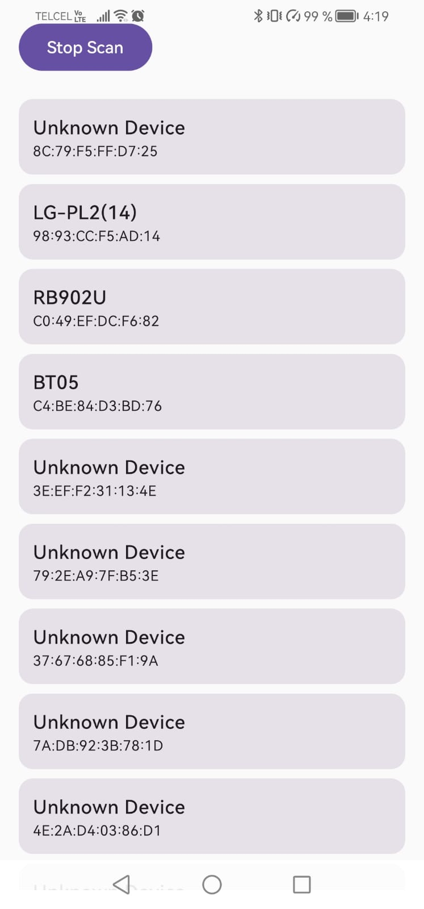
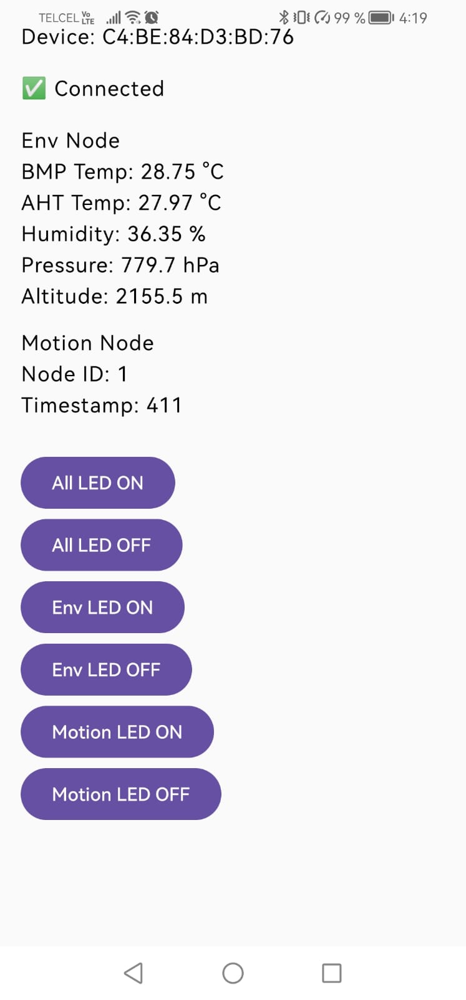
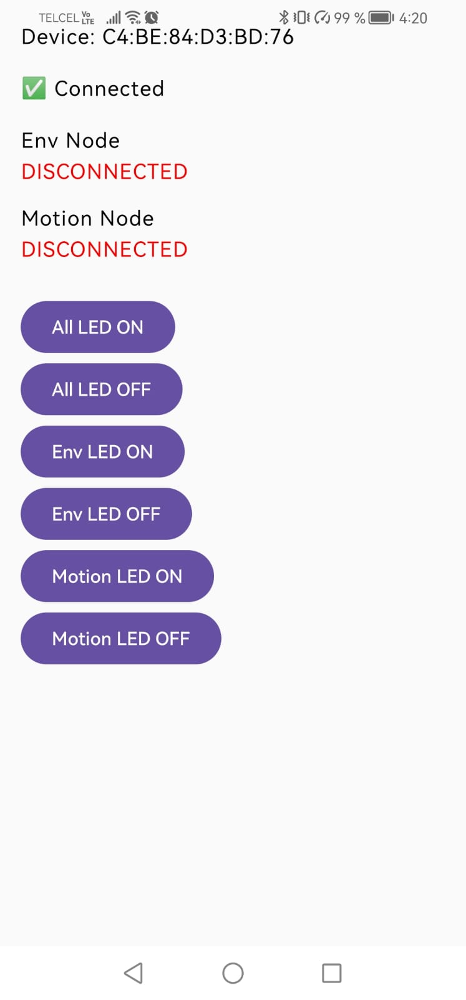

# 📱 Android – CAN BLE Monitor App (Jetpack Compose)

This Android application connects to the STM32 BLE Gateway and provides:

- 📡 Real-time monitoring of CAN Motion & Environment nodes
- 🎮 Command transmission to remote nodes
- 🔄 Reactive UI updates using StateFlow
- 🧠 Binary protocol parsing with CRC16 validation
- 🏗 Clean Architecture with Hilt dependency injection

It acts as a mobile monitoring and control interface for the STM32 CAN-BLE distributed system.

---

# ✨ Features

- 🔍 BLE device scanning
- 🔗 GATT connection management
- 📥 Notification-based real-time telemetry
- 🧠 Binary protocol parser (AA 55 framed + CRC16)
- 📊 Motion & Environmental data decoding
- 🚦 Node disconnection detection (Status frames)
- 🎮 LED command transmission
- 🧩 Clean MVVM architecture
- 💉 Hilt dependency injection
- ⚡ Fully reactive UI (StateFlow + Compose)

---

# 🏗️ Architecture Overview

```
UI (Jetpack Compose)
        │
        ▼
ViewModel (StateFlow)
        │
        ▼
Repository
        │
        ▼
BLE DataSource (BluetoothGatt)
        │
        ▼
STM32 BLE Gateway
        │
        ▼
CAN Bus
        │
        ▼
Motion Node + Env Node
```

---

# 📂 Project Structure

```
ble4app/
│
├── data/
│   ├── ble/
│   │   ├── BleDataSource
│   │   ├── BleDataSourceImpl
│   │   └── BleDevice
│   │
│   ├── protocol/
│   │   ├── Commands
│   │   ├── Crc16
│   │   ├── Frame
│   │   ├── FrameBuilder
│   │   └── ProtocolParser
│   │
│   └── repository/
│       ├── BleRepository
│       └── BleRepositoryImpl
│
├── di/
│   ├── BleModule
│   └── RepositoryModule
│
├── navigation/
│   └── Routes
│
├── presentation/
│   ├── scanner/
│   │   ├── ScannerScreen
│   │   ├── ScannerUiState
│   │   └── ScannerViewModel
│   └── device/
│       ├── DeviceScreen
│       ├── DeviceUiState
│       └── DeviceViewModel
│
├── MainActivity.kt
└── MyApp.kt
```

---

# 🔍 BLE Configuration

| Parameter           | Value                                  |
|---------------------|----------------------------------------|
| Service UUID        | `0000ffe0-0000-1000-8000-00805f9b34fb` |
| Characteristic UUID | `0000ffe1-0000-1000-8000-00805f9b34fb` |
| CCC Descriptor      | `0x2902`                               |
| Write Type          | Default (WRITE_TYPE_DEFAULT)           |

The app enables notifications via the Client Characteristic Configuration Descriptor (CCCD).

---

# 🧠 Binary Protocol

The application uses a custom framed binary protocol:

```
[ 0xAA | 0x55 | LEN | TYPE | PAYLOAD | CRC_L | CRC_H ]
```

- CRC16-CCITT (0x1021 polynomial)
- Little-endian multi-byte values
- Stream-safe state machine parser

---

## 📦 Frame Types

### Motion Frame (0x01)

Payload:
```
[ node_id (1B) | timestamp (4B) ]
```

Displayed as:
- Node ID
- Timestamp

---

### Environment Frame (0x02)

Payload:
```
[ bmpTemp | ahtTemp | humidity | pressure | altitude ]
```

Decoded as:
- Temperature (°C)
- Humidity (%)
- Pressure (hPa)
- Altitude (m)

---

### Status Frame (0x03)

Used to detect:
- Motion node disconnection
- Environment node disconnection

UI automatically updates node connection state.

---

# 🎮 Implemented Commands

| Button         | Command |
|----------------|---------|
| All LED ON     | 0x11    |
| All LED OFF    | 0x10    |
| Env LED ON     | 0x15    |
| Env LED OFF    | 0x14    |
| Motion LED ON  | 0x13    |
| Motion LED OFF | 0x12    |

Commands are built using `FrameBuilder` and transmitted as framed binary packets.

---

# 🔐 Permissions

## Android 12+

```
BLUETOOTH_SCAN
BLUETOOTH_CONNECT
```

## Below Android 12

```
ACCESS_FINE_LOCATION
```

Permissions are requested dynamically via `ActivityResultContracts`.

---

# 🧩 Key Technical Decisions

### Buffered SharedFlow for Notifications

BLE notifications can arrive rapidly.  
The app uses:

```
MutableSharedFlow(
    replay = 0,
    extraBufferCapacity = 128,
    onBufferOverflow = DROP_OLDEST
)
```

This prevents frame loss during bursts.

---

### Repository Pattern

Separates:
- BLE transport
- Protocol parsing
- UI state management

Improves:
- Testability
- Maintainability
- Scalability

---

## ▶️ How to Run

Clone the repository:
```bash
git clone https://github.com/JavierRiv0826/STM32-RTOS-COM-CAN-BLE4.git
```
1. Open the project in Android Studio
2. Run the app on a physical Android device (Android 8.0+) or emulator.
3. Grant permissions
4. Scan and connect to STM32 BLE Gateway
5. Observe real-time telemetry
6. Send LED commands

---

# ⚠️ Security Note

Current implementation:
- No pairing required
- No encryption enforcement

For production:
- Enable BLE pairing/bonding
- Use encrypted characteristics
- Add device filtering
- Validate device MAC whitelist

---

## 📸 Screenshots

### 🔍 Device Scan

<p align="center">
  
  <br>
  <em>Device Scan</em>
</p>


### 📦 Motion/Environment Frames Received

<p align="center">
  
  <br>
  <em>Frames received</em>
</p>

### 📡 Node Offline Status

<p align="center">
  
  <br>
  <em>Nodes Offline</em>
</p>

---

## 👤 Author
Javier Rivera  
GitHub: JavierRiv0826