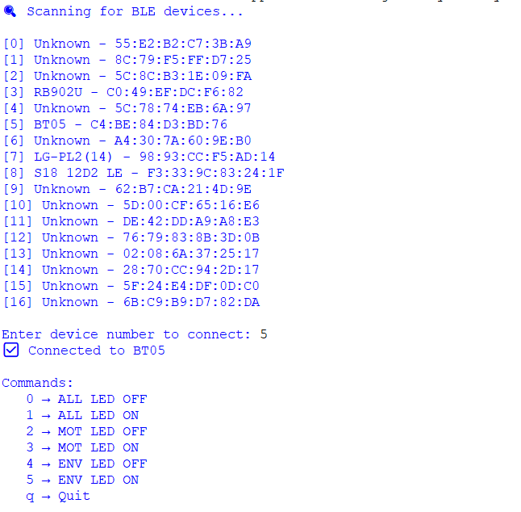
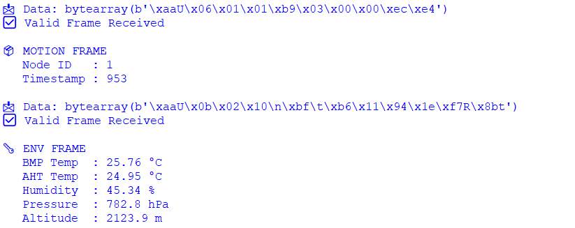

# 🐍 Python BLE Monitor & Control Client

This Python application connects to the BLE Gateway (STM32 + HM-10) and provides:

- 📡 Real-time telemetry monitoring (Motion + Environment)
- 🎮 Remote CAN command transmission via BLE
- 🖥️ Interactive keyboard-based control
- 🔍 Binary protocol parsing with CRC validation

It acts as a desktop control panel for testing and debugging the CAN + BLE distributed system.

---

# 🚀 Features

- BLE 4.0 communication using Bleak
- Custom binary protocol parser (CRC16-CCITT)
- Full-duplex communication (notify + write)
- Non-blocking keyboard listener
- Asyncio-based event loop
- Live decoding of telemetry frames
- Command routing to specific CAN nodes

---

# 📡 BLE Configuration

| Parameter           | Value                                |
|---------------------|--------------------------------------|
| Service UUID        | 0000ffe0-0000-1000-8000-00805f9b34fb |
| Characteristic UUID | 0000ffe1-0000-1000-8000-00805f9b34fb |
| Transport           | HM-10 (UART transparent mode)        |

The script scans for available BLE devices and allows manual selection.

---

# 📦 Supported Frame Types

## Motion Frame (BLE_TYPE_MOTION = 0x01)

Payload format:

```
<BI
```

| Field     | Type   |
|-----------|--------|
| node_id   | uint8  |
| timestamp | uint32 |

---

## Environment Frame (BLE_TYPE_ENV = 0x02)

Payload format:

```
<hhHHh
```

| Field    | Unit    |
|----------|---------|
| BMP Temp | °C ×100 |
| AHT Temp | °C ×100 |
| Humidity | % ×100  |
| Pressure | hPa     |
| Altitude | m       |

---

## Status Frame (BLE_TYPE_STATUS = 0x03)

Indicates node disconnection.

Example:

```
STATUS_NODE_DISCONNECTED
NODE_TYPE_MOTION
```

---

# 🎮 Command System

Keyboard commands:

| Key | Action         |
|-----|----------------|
| 0   | ALL LED OFF    |
| 1   | ALL LED ON     |
| 2   | Motion LED OFF |
| 3   | Motion LED ON  |
| 4   | Env LED OFF    |
| 5   | Env LED ON     |
| q   | Quit           |

Commands are sent as BLE frames and translated by the Gateway into CAN MSG_COMMAND frames.

---

# 🏗️ System Architecture

```
Motion / Env Node (STM32)
        │
        │ CAN 500 kbps
        ▼
Gateway Node (STM32 + FreeRTOS)
        │
        │ UART 9600
        ▼
HM-10 BLE Module
        │
        ▼
Python BLE Client
```

---

# 🧰 Requirements

- Python 3.8+
- Windows / Linux / macOS with BLE support

### Install Dependencies

```bash
pip install bleak pynput
```

---

# 💡 How to Run 🧪

### 1️⃣ Clone Repository

```bash
git clone https://github.com/JavierRiv0826/STM32-RTOS-COM-CAN-BLE4.git
```

### 2️⃣ Navigate to Python Folder

```bash
cd python
```

### 3️⃣ Run Script

```bash
python ble4_monitor.py
```

### 4️⃣ Select BLE Device

The script will scan and display available devices.

Example:

```
[5] BT05 - C4:BE:84:D3:BD:76
```

Enter the number to connect.

---

# 🔍 How It Works

## BLE

- Uses BleakClient
- Subscribes to notifications
- Sends commands without response flag

## Protocol Parsing

- Stateful parser
- CRC16 validation
- Byte-by-byte processing
- Frame reconstruction

## Keyboard Handling

- Uses pynput
- Runs in separate thread
- Non-blocking with asyncio queue bridge

## Clean Shutdown

- Stops keyboard listener
- Stops BLE notifications
- Disconnects gracefully

---

## 📸 Screenshots

### 🔍 Device Scan

<p align="center">
  
  <br>
  <em>Device Scan</em>
</p>


### 📦 Motion/Environment Frames Received

<p align="center">
  
  <br>
  <em>Frames received</em>
</p>

---

# 🔐 Security Note ⚠️

Currently using:

- BLE without pairing enforcement
- No encryption at application layer

For production systems:

- Enable BLE pairing & bonding
- Add message authentication
- Implement encrypted transport

---

# 👨‍💻 Author

Javier Rivera  
GitHub: JavierRiv0826